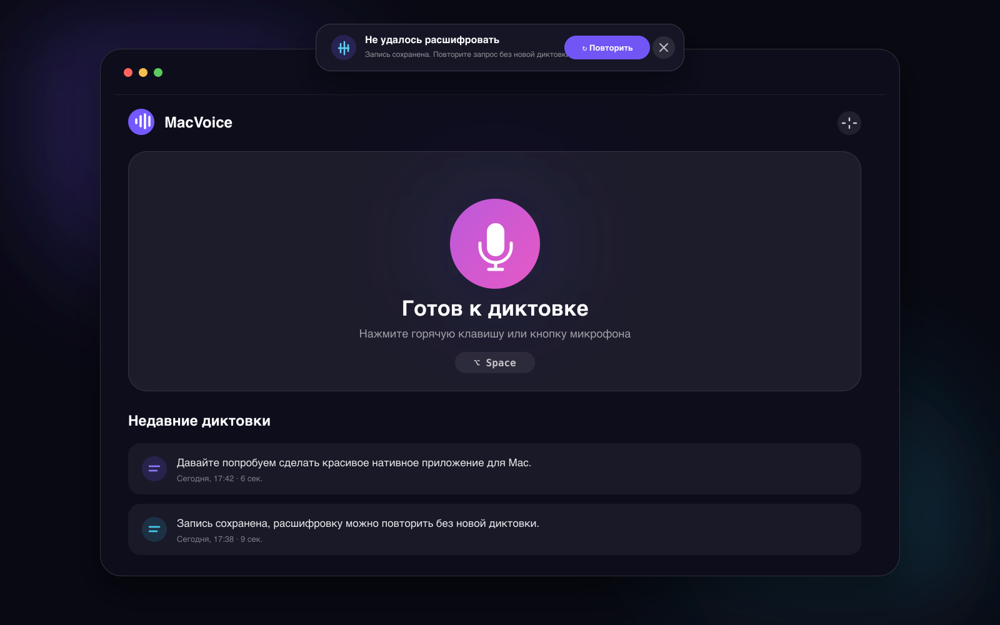

# MacVoice

Native Russian dictation for macOS, powered by your own OpenAI API key.

MacVoice records speech after a global shortcut, transcribes it with
`gpt-4o-transcribe`, copies the result, and optionally pastes it into the app
you were using. There is no MacVoice server and no subscription.

> Русская версия: MacVoice — нативная диктовка для macOS. Нажмите горячую
> клавишу, продиктуйте текст и нажмите её повторно. Результат будет скопирован
> и вставлен в активное приложение.



_Interface preview generated from the implemented SwiftUI design system._

## Highlights

- Accurate Russian transcription with punctuation and capitalization.
- Customizable global shortcut, `⌥ Space` by default.
- Native SwiftUI interface, menu bar control, Dock app, and floating waveform.
- Automatic paste with a clipboard fallback.
- **Retry transcription from the same recording** after a network or API error.
- API key stored only in macOS Keychain.
- Optional local text history using SwiftData; audio is never added to history.
- Custom vocabulary for names, brands, abbreviations, and technical terms.
- English and Russian interface with instant switching across windows, menu bar, settings, and the floating overlay.
- No analytics, accounts, third-party server, or hidden subscription.

## Requirements

- Apple Silicon Mac.
- macOS 15 or newer.
- Xcode 16 or newer for development.
- An [OpenAI API key](https://platform.openai.com/api-keys) with billing enabled.

ChatGPT subscriptions do not include API usage.

## API cost

OpenAI currently estimates `gpt-4o-transcribe` at **$0.006 per minute**:

| Dictation per month | Estimated cost |
| ---: | ---: |
| 100 minutes | $0.60 |
| 500 minutes | $3.00 |
| 1,000 minutes | $6.00 |

Pricing can change. Check the official
[OpenAI API pricing page](https://developers.openai.com/api/docs/pricing)
before relying on these estimates.

## Build

1. Install the full Xcode application and select it:

   ```bash
   sudo xcode-select -s /Applications/Xcode.app/Contents/Developer
   ```

2. Open `MacVoice.xcodeproj`.
3. Select the `MacVoice` scheme and **My Mac**.
4. Build and run.
5. On first launch, choose Russian or English on the onboarding language screen.
6. Complete onboarding and enter your OpenAI API key.

You can change the interface language later in **Settings → General → Language**. The app updates open windows, the menu bar, settings, and the floating overlay immediately without restart.

The repository also includes `Package.swift` for editor indexing and lightweight
logic checks. The Xcode project is the authoritative application build.

## Permissions

MacVoice requests:

- **Microphone** to record only while the recording indicator is visible.
- **Accessibility** to send `⌘V` to the previously active application.
- **Keychain** to store your OpenAI API key securely.

When macOS shows the Keychain access prompt after saving your API key, choose **Always Allow** (Russian: **Разрешать всегда**). This keeps the key available after restart and avoids repeated prompts. Onboarding includes a dedicated step explaining this choice.

Accessibility is optional. Without it, the transcription is still copied to the
clipboard.

If a transcription request fails, the temporary recording remains on the Mac
and the UI offers **Retry transcription**. It is deleted after a successful
retry, explicit cancellation, starting a new recording, or quitting MacVoice.

## Privacy and secrets

- The OpenAI API key is stored with `kSecAttrAccessibleAfterFirstUnlockThisDeviceOnly`.
- The key is never written to `UserDefaults`, `.env`, logs, or source files.
- `.env.example` exists only for optional release credentials.
- Audio is sent directly from the Mac to OpenAI's transcription endpoint.
- Successful audio files are deleted immediately.
- Local history contains text, date, duration, and paste status only.

Review [OpenAI's privacy policy](https://openai.com/policies/privacy-policy/)
before using the service with sensitive information.

## Tests

With Xcode installed:

```bash
xcodebuild \
  -project MacVoice.xcodeproj \
  -scheme MacVoice \
  -destination 'platform=macOS,arch=arm64' \
  test CODE_SIGNING_ALLOWED=NO
```

Tests cover settings, localization, onboarding language flow, multipart file uploads,
API error mapping, local history, state transitions, temporary-file cleanup, retrying
a failed transcription without recording again, and basic performance checks for upload
assembly.

For manual performance validation, profile **Debug** and **Release** builds in Xcode
with Instruments (CPU, SwiftUI, Allocations) while idle, recording, and uploading a
long WAV file.

## DMG

Create an unsigned local DMG:

```bash
./scripts/build-dmg.sh
```

Until a Developer ID certificate is configured, Gatekeeper may require users to
right-click MacVoice and choose **Open** on first launch. The release script and
GitHub workflow support optional signing and notarization through environment
variables documented in `.env.example`.

## Architecture

- SwiftUI for the main app, onboarding, settings, and menu bar.
- AppKit `NSPanel` for the non-activating floating recording UI.
- `AVAudioEngine` for temporary WAV recording and live audio levels; feedback sounds start their engine only while playing.
- Carbon hot keys for a system-wide toggle shortcut.
- `URLSession` upload from a temporary multipart file for direct OpenAI requests.
- Keychain Services for the API key.
- SwiftData for optional text-only history.
- Accessibility and Core Graphics events for automatic paste.

## Contributing

Read [CONTRIBUTING.md](CONTRIBUTING.md) before opening a pull request. Security
issues should follow [SECURITY.md](SECURITY.md).

## License

MIT © 2026 Nikita.
